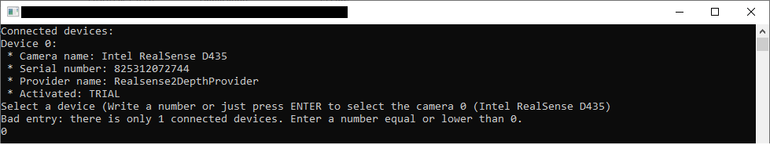
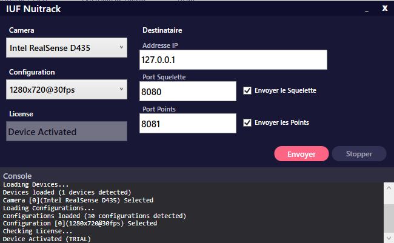

# iuF_Nuitrack

See the First Part: [iuF_Intel_Realsense](https://github.com/mlhoutel/iuF_Intel_Realsense)

## Second Step: Exporting the Datas with UDP

## Cmd and GUI versions


[Browse the CMD versions](https://github.com/mlhoutel/iuF_Nuitrack)



[Browse the GUI versions](https://github.com/mlhoutel/iuF_Nuitrack/tree/feature/GUI)

## Testing Sending

Launch the program with the localhost address

install netcat [Windows](https://github.com/diegocr/netcat)

```
nc -lvu 127.0.0.1 -p 8080
```

## Send to Unity

1. Install Unity

2. Install the Unity Plugin [Here](https://github.com/Theia-VR/UnityPlugin)

3. Create a 3D Unity project and follow the instruction from [Here](https://github.com/Theia-VR/UnityPlugin/blob/master/README.md#how-to-use)

### Streamed Data Formats

```
Vertexs (Depth and Color)
-------------------------------
Beggining of the Chunk:
- TimeStamp (8bytes)
...
[1280 x 720] Pixels (of 16bytes)
- X: x position		(4 byte)
- Y: y position		(4 byte)
- Z: z position		(4 byte)
- R: red color		(1 byte)
- G: green color	(1 byte)
- B: blue color		(1 byte)
- (?)				(1 byte)
```

```
Skeleton (Joints)
-------------------------------
Beggining of the Chunk:
- TimeStamp (8bytes)
...
[NbUsers x 24] Joints: (of 13bytes)
- Type: joint type  (1 byte)
- X: x position		(4 byte)
- Y: y position		(4 byte)
- Z: z position		(4 byte)
-------------------------------
Joints Types:
    None = 0,
    Head = 1,
    Neck = 2,
    Torso = 3,
    Waist = 4,
    LeftCollar = 5,
    LeftShoulder = 6,
    LeftElbow = 7,
    LeftWrist = 8,
    LeftHand = 9,
    LeftFingertip = 10,
    RightCollar = 11,
    RightShoulder = 12,
    RightElbow = 13,
    RightWrist = 14,
    RightHand = 15,
    RightFingertip = 16,
    LeftHip = 17,
    LeftKnee = 18,
    LeftAnkle = 19,
    LeftFoot = 20,
    RightHip = 21,
    RightKnee = 22,
    RightAnkle = 23,
    RightFoot = 24
```
